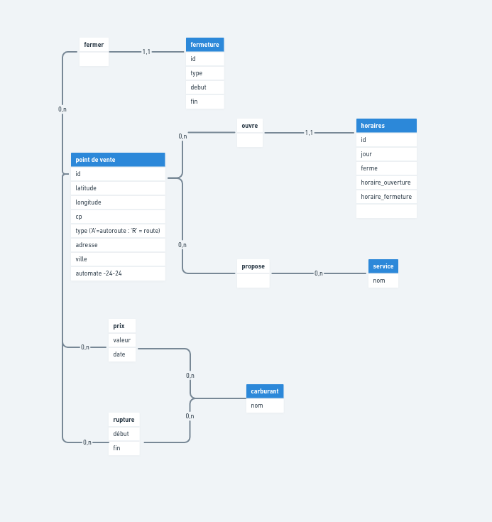
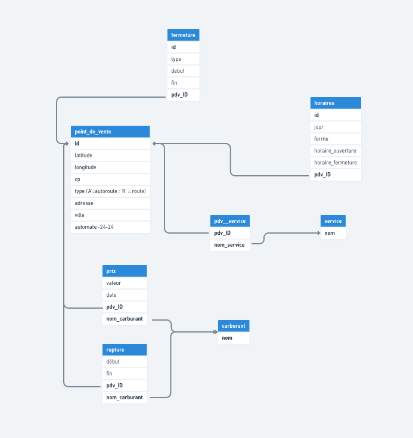

## Base de données 
 est un ensemble d'informations qui est organisé de manière à être facilement accessible, géré et mis à jour. Elle est utilisée par les organisations comme méthode de stockage, de gestion et de récupération de l’informations.


### Une base de données doit etre:
* indépendente d’applications particuliéres ;
* cohérente ;
* de redondance minimale ;
* accessible simultanément par plusieurs utilisateurs.

## Systéme de Gestion de Base de Données
***Un système de gestion de base de données (SGBD)*** est le logiciel qui permet à un ordinateur de stocker, récupérer, ajouter, supprimer et modifier des données. Un SGBD gère tous les aspects primaires d'une base de données, y compris la gestion de la manipulation des données, comme l'authentification des utilisateurs, ainsi que l'insertion ou l'extraction des données. Un SGBD définit ce qu'on appelle le schéma de données ou la structure dans laquelle les données sont stockées. 


***Le SGBD gère trois choses importantes :***
* les données, 
* le moteur de base de données qui permet d'accéder aux données, de les verrouiller et de les modifier,
* le schéma de base de données, qui définit la structure logique de la base de données. 

Ces trois éléments fondamentaux contribuent à assurer la concomitance, la sécurité, l'intégrité des données et l'uniformité des procédures administratives.

## Système d'information 
Un système d'information est un ensemble organisé de ressources (matérielles, logicielles, humaines, procédures) qui collecte, stocke, traite et diffuse des informations dans le but de soutenir la prise de décision, la coordination et le contrôle au sein d'une organisation. Il englobe les aspects techniques, organisationnels et humains nécessaires pour gérer les données et les transformer en informations pertinentes. Les systèmes d'information peuvent utiliser des bases de données comme support pour stocker et gérer les données nécessaires à leur fonctionnement.

## Différences entre BD, SGBD et SI.
En résumé, un SGBD est un logiciel qui permet de gérer les bases de données, tandis qu'une base de données est une collection de données organisées et stockées. Un système d'information est un ensemble de ressources qui utilise une ou plusieurs bases de données pour collecter, traiter et diffuser des informations au sein d'une organisation.

## Le modèle conceptuel des données (MCD)
 a pour but d'écrire de façon formelle les données qui seront utilisées par le système d'information. Il s'agit donc d'une représentation des données, facilement compréhensible, permettant de décrire le système d'information à l'aide d'entités. 
 
 

 ## Le modèle logique de données (MLD) 
  est une étape de la méthodologie Merise. C’est une des dernières étapes proposée et elle permet d’implémenter la base de données en transcrivant le MCD/MPD en instructions SQL adaptées au SGBDR prévu. Concrètement, le MLD permet de connaître le nombre de tables ainsi que leurs contraintes (liaisons entre tables) à mettre en œuvre dans une base de données relationnelle.
  
  ### Réaliser un MLD
  * Chaque ligne représente une table ;
  * C’est toujours le nom de la table qui est écrit en premier ;
  * Les champs sont listés entre parenthèses et séparés par des virgules ;
  * Les clés primaires sont soulignées et placées au début de la liste des champs ;
  * Les clés étrangères sont préfixées par un dièse
  ### Assosiation
  1. Asso type 1.1 fusion des tables et suppression de id_unique
  2. Asso type 1.n ajout dans l'entité 1 d'une clé étrang.= clé primaire de l'entité n
  3. Asso type n.n ajout des nouvelle table contenant les deux clés primaires + attributes de l'asso

```
```

### Structured Query Language 
permmet intorogé la base de données rélationnelle.

Base de données rélationnelle - une systeme qui va souvegarder les informations sous forme d'un tableau de deux dimention appelés des relation ou tables
### cmd 
